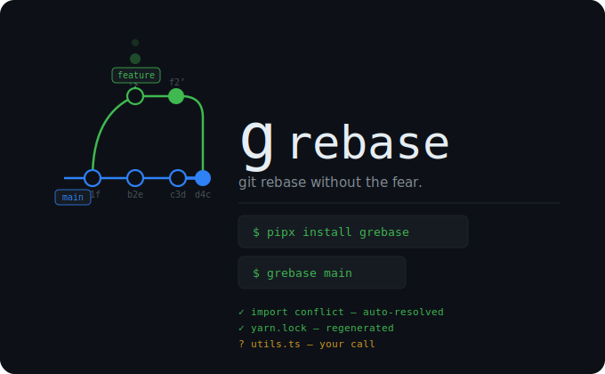

<div align="center">
  
  <br/><br/>

  [](https://github.com/Aniketsy/grebase/actions/workflows/ci.yml)
  [](https://pypi.org/project/grebase)
  [](LICENSE)
  [](https://www.python.org)
  

</div>

---

## Why grebase?

Rebasing is painful because of the **middle part** — editing conflict markers in files, remembering to `git add` instead of `git commit`, repeating this for every commit. Most conflicts are trivial (import reordering, lockfile churn, whitespace) but git treats them all the same.

grebase handles the boring ones automatically and surfaces only the ones that genuinely need your eyes.

---

## Install

```bash
pipx install grebase
```

> Requires Python 3.11+. `pipx` is recommended so it doesn't pollute your global environment.

**For contributors:**
```bash
git clone https://github.com/Aniketsy/grebase
pip install -e .[dev]
```

> **Windows:** Install [Git for Windows](https://gitforwindows.org) and make sure `git` is on your PATH. Run `pipx ensurepath` after installing pipx.

---

## Usage

```bash
grebase              # auto-detect target branch and rebase
grebase main         # rebase onto main
grebase origin/main  # rebase onto a specific remote ref
```

**Mid-rebase commands:**
```bash
grebase --continue   # after manually resolving a conflict
grebase --skip       # skip the current commit
grebase --abort      # bail out and restore original state
```

**Flags:**

| Flag | Description |
|---|---|
| `--policy mine\|theirs` | Default for ambiguous conflicts: keep yours or take theirs |
| `--safe-only` | Auto-resolve only — never guess, prompt for everything else |
| `--dry-run` | Simulate the full rebase without writing any files |
| `--non-interactive` | No prompts — exits if a decision is needed |
| `--audit` | Write a decision log to `.git/grebase.log` |
| `--remote <name>` | Remote to use: `auto`, `origin`, `upstream`, or any name |
| `--status` | Show current rebase state |
| `--verbose` | Detailed output |
| `--version` | Show grebase version and exit |

---

## What it auto-resolves

grebase applies deterministic rules. It never guesses at logic — if a conflict looks semantic, it asks you.

| Conflict type | What grebase does |
|---|---|
| **Import statements** | Merges unique imports from both sides |
| **Whitespace / formatting** | Takes the non-whitespace version silently |
| **Documentation** | Safely merges when both sides only change docs |
| **Duplicate inserts** | Deduplicates identical blocks |
| **Lockfiles** | Strips conflict markers, regenerates safely (`poetry lock --no-update`, `npm install`). Skips if yarn merge driver is detected. Asks confirmation in interactive mode. |

**Lockfile regeneration** — grebase runs the correct tool automatically:

```
poetry.lock       → poetry lock --no-update   # preserves existing versions
Pipfile.lock      → pipenv lock
package-lock.json → npm install
yarn.lock         → yarn install              # skipped if merge driver detected
pnpm-lock.yaml    → pnpm install

> After any lockfile regeneration, review what changed with `git diff -- <lockfile>`.
> Package versions may change. Use `--safe-only` to skip lockfiles entirely.
```

If the tool isn't installed or fails, grebase falls back to prompting you.

---

## How it looks

```
$ grebase main

✓  Repository detected
✓  Current branch: feature/auth-improvements
✓  Target branch:  main
◆  Incoming changes — auth.py, yarn.lock
✓  import conflict in auth.py — auto-resolved
✓  yarn.lock — regenerated via yarn install
!  Conflict: utils.ts — semantic change detected

   1. Keep mine        2. Take theirs
   3. Keep mine (all)  4. Take theirs (all)
   5. Show diff        6. Skip    7. Abort
   > 2

✓  Rebase complete — 3 commits applied cleanly
```

---

## Safety

- **Never rewrites logic silently.** Semantic conflicts always get a prompt.
- **Always abortable.** `Ctrl+C` or `grebase --abort` restores your branch exactly as it was.
- **Audit trail.** `--audit` logs every decision to `.git/grebase.log`.
- **Dry-run first.** `--dry-run` shows exactly what would happen before touching anything.
- **Lockfiles are never silently regenerated.** In interactive mode grebase asks for confirmation before touching any lockfile. Use `--safe-only` to skip them entirely.

---

## Troubleshooting

**Dirty working tree**
Commit or stash your changes first, then run grebase.

**Rebase already in progress**
Use `grebase --continue`, `grebase --abort`, or `grebase --skip`.

**Lockfile tool missing**
Install the relevant package manager, or resolve manually and run `grebase --continue`.

---

## Contributing

Contributions are very welcome — this is early-stage and your feedback matters.

- Read [CONTRIBUTING.md](CONTRIBUTING.md) to get started
- Keep PRs small and focused
- Add tests for any new behavior
- New conflict resolvers go in `grebase/rules.py` and `grebase/conflict_classifier.py`

```bash
pytest                        # run tests
grebase --dry-run --verbose   # test against a local repo
```

---

<div align="center">

MIT License · Built for devs who live in the terminal · [github.com/Aniketsy/grebase](https://github.com/Aniketsy/grebase)

</div>
